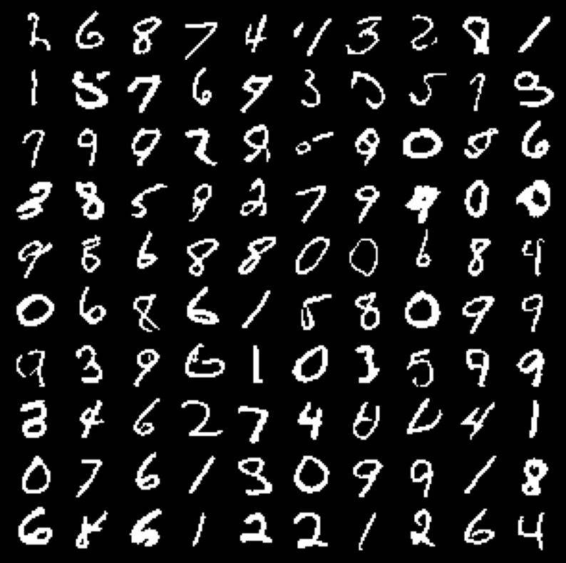
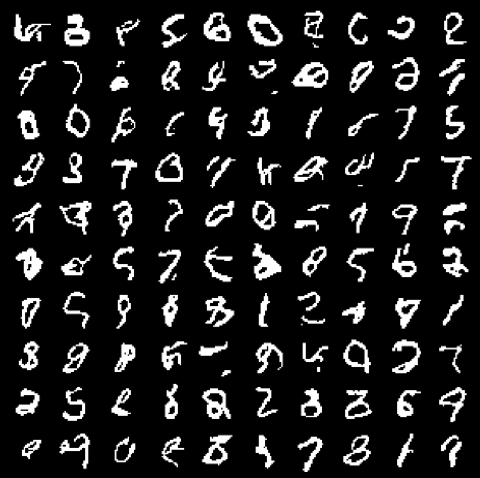
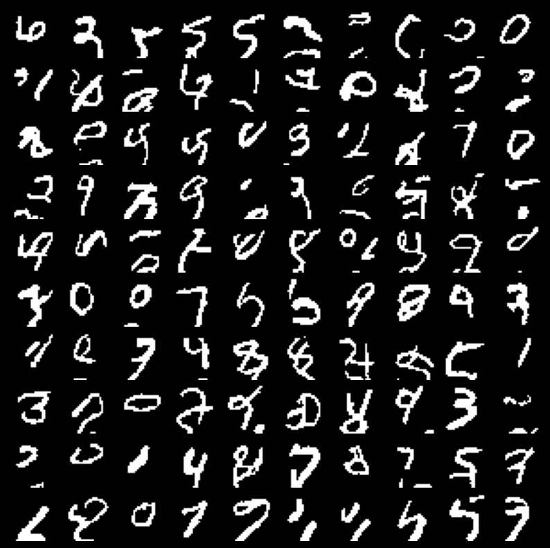

## Pixel RNN implementation in JAX

This repo implements the 3 variants of PixelRNN (van den Oord et. al.) namely, Row-LSTM, Diagonal-BiLSTM and PixelCNN in JAX.

[PixelRNN Paper](https://arxiv.org/abs/1601.06759)

### Implementation Progress

<!-- tick mark - "&#x2611;" -->
<!-- cross - "&#x2612;"  -->

||Row-LSTM | Diagonal-BiLSTM | PixelCNN|
|-|--|--|--|
|Basic impl|&#x2611;|&#x2611;|&#x2611;|
|Residual Connections|&#x2611;|&#x2611;|&#x2611;|
|Skip Connections|&#x2611;|&#x2611;|--|
|Supports RGB images (masked conv)|--|--|--|

### Trained Diagonal-BiLSTM on Binarized MNIST

You can find the training loop in diagonal_bilstm_mnist.ipynb . 

The above images are generated from a Diagonal-BiLSTM trained with

- model hyper-params:
    - hidden_dim = 16
    - num-layers = 7
    - skip-connections & residual connections
- training params:
    - batch-size = 64
    - training-images = 6M
    - on binarized MNIST data
    - Adam with lr=1e-3

This achieves a NLL of ~80 nats (== 55.3 bits) which is almost same as the paper.

### Trained Row-LSTM on Binarized MNIST

You can find the training loop in row_lstm_mnist.ipynb . 

The above images are generated from a Row-LSTM trained with

- model hyper-params:
    - i-s kernel width = 3
    - s-s kernel width = 3
    - num-layers = 16
    - hidden-dim = 16
    - skip-connections & residual connections
- training params:
    - batch-size = 16
    - training-images = 900K
    - on binarized MNIST data

### Trained PixelCNN on Binarized MNIST

- model hyper-params:
    - input/output features per conv layer = 64
    - num-layers = 8
    - residual connections
- training params:
    - batch-size = 16
    - training-images = 3.6M images
    - on binarized MNIST data